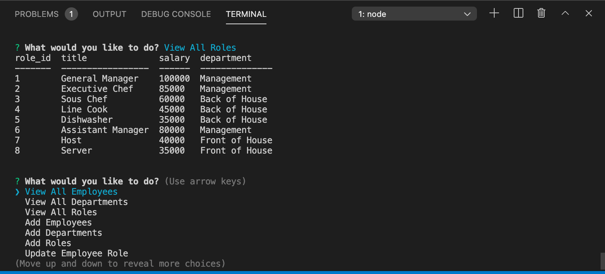
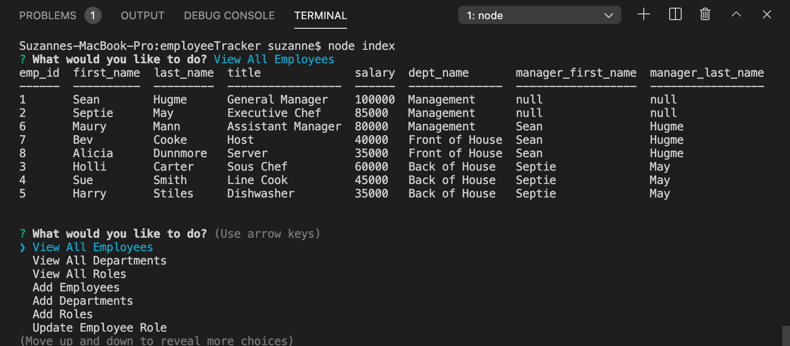

# employeeTracker
## Objective
Developers are often tasked with creating interfaces that make it easy for non-developers to view and interact with information stored in databases. Often these interfaces are known as **C**ontent **M**anagement **S**ystems. In this homework assignment, your challenge is to architect and build a solution for managing a company's employees using node, inquirer, and MySQL.

## Technologies Used
* Node js
* Inquirer
* MySql

## Project Screenshots and Demo

Application being ran in command line. User is prompted to answer a series of questions, which then generates a corresponding table .

#### Link to Demo

[Video](https://drive.google.com/file/d/1KDtvPTgdzJiKIW9efuIwKCgop7Ya08SK/view?usp=sharing)

## Contact
* https://github.com/srad25
* https://github.com/srad25/employeeTracker